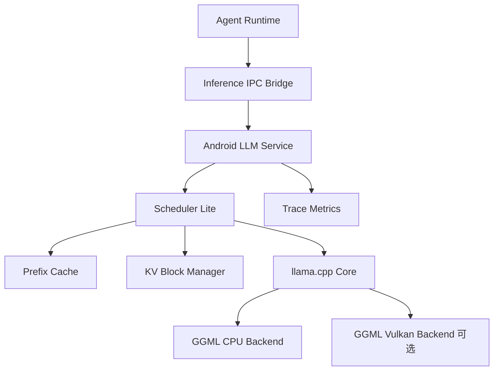

# Android 端 vLLM 核心能力移植方案（llama.cpp + Vulkan/OpenGL）

## 1. 课题定位与目标

本子课题是 [plan_cyq_2.md](./plan_cyq_2.md) 中“Android Agent Runtime + 本地小模型协同系统”的推理内核部分，目标不是把 vLLM 全量搬到 Android，而是：

1. 提取 vLLM 对本项目真正关键的能力。
2. 基于 `llama.cpp/ggml` 在 Android arm64 上重建这些能力。
3. 形成 `CPU-first` 可稳定运行版本，再做 `Vulkan` 增强，`OpenGL ES` 仅作为备选。

本方案对应的最终产物是一个 **可在 Android 上运行的轻量推理引擎原型**，为上层 Agent Runtime 提供：

- 低时延单用户/小并发推理
- 工具调用（tool calling）约束输出
- KV cache 与前缀复用
- 结构化日志与可复现实验指标

## 2. 为什么不直接移植 vLLM 原代码

## 2.1 结论

对于 OS 课程项目和 Android 端约束，**“移植 vLLM 核心思想”优于“移植 vLLM 原工程”**。

## 2.2 直接移植 vLLM 的主要工程阻力

1. `vLLM` 以服务器场景为中心，依赖 Python 运行时、CUDA/Triton 生态与高吞吐调度假设。
2. Android 端缺少 CUDA，Triton 内核路径基本不可复用。
3. 大量 serving 组件（HTTP server、异步引擎、多进程管理）与移动端目标不一致。
4. Android 上内存和热功耗预算更严格，vLLM 的“高吞吐优先”策略不一定是最优点。
5. 直接移植会把时间耗在兼容层和构建系统，不利于课程项目按期交付。

## 2.3 采用 llama.cpp 路线的优势

1. `llama.cpp` 原生 C/C++，跨平台成熟，Android NDK 编译路径清晰。
2. `ggml` 对 ARM NEON、dotprod、F16/F32/量化支持完善，端侧经验丰富。
3. 可以最小增量实现“vLLM 的关键机制”，而不引入不必要复杂度。
4. CPU-only 可先出稳定版本，便于完成基线实验和系统联调。
5. 后续加 Vulkan 是增量增强，不会推翻主链路。

## 3. 技术总览：移植“能力”而不是“代码”

下表定义了“vLLM 核心能力”到“llama.cpp 改造点”的映射。

| vLLM 核心能力 | Android 目标形态 | llama.cpp 改造模块 |
| --- | --- | --- |
| Paged KV Cache | 固定大小 block 的 KV 分页管理，支持回收与复用 | `kv_block_manager` |
| Continuous Batching | 小并发请求下的轻量调度，优先 decode 低时延 | `android_scheduler` |
| Prefix Cache | 复用系统提示词和高频前缀 | `prefix_cache` |
| Structured Generation | 输出 JSON/tool call，降低自由生成漂移 | `tool_call_decoder` |
| Token Streaming | 逐 token 返回给 Agent Runtime | `stream_bridge` |
| Telemetry | 推理时延/内存/温度打点 | `trace_metrics` |

该策略的关键点：

- **复用 vLLM 设计思想**：分页 KV、调度、复用。
- **放弃与移动端无关能力**：多租户高并发 server、多机分布式、复杂异步编排。

## 4. 系统架构（Android 端）



说明：

1. `Agent Runtime` 通过 AIDL/JNI 向 `Android LLM Service` 发请求。
2. `Scheduler Lite` 管理小并发请求和 token 轮转。
3. `KV Block Manager` + `Prefix Cache` 实现 vLLM 式核心收益。
4. 后端先 `CPU`，再开启 `Vulkan`。

## 5. 具体实现方案

## 5.1 第 0 步：分叉与最小可运行版本

1. 分叉 `llama.cpp` 到课程仓库子目录（建议 `third_party/llama.cpp`）。
2. 固定 Android NDK、CMake、编译参数，确保 `arm64-v8a` 可运行。
3. 先跑通单请求推理与流式输出（不做调度和分页）。

验收标准：

- Android 设备上可加载 `Qwen3-0.6B` 的 gguf 版本并输出稳定 token。
- 记录 TTFT（首 token 时延）和 tokens/s。

## 5.2 第 1 步：实现 KV 分页管理（核心）

目标：把“单块连续 KV 缓冲”升级为“可分页、可回收”的 block 池。

设计要点：

1. 设定 `block_size`（例如 16 或 32 token/block）。
2. 每个请求维护 block 链表，decode 时按需追加 block。
3. 结束请求后 block 归还全局空闲池。
4. 支持前缀共享时的引用计数（只读共享块）。

关键数据结构建议：

```cpp
struct KvBlock {
    int id;
    int used_tokens;
    int ref_count;
    void* k_ptr;
    void* v_ptr;
};

struct RequestKvState {
    std::vector<int> block_ids;
    int total_tokens;
};
```

验收标准：

- 多轮请求后无明显内存碎片恶化。
- 与基线相比，长会话下 OOM 触发率下降。

## 5.3 第 2 步：实现 Continuous Batching Lite

目标：在移动端实现“低并发友好”的 token 级调度，而非服务器式高吞吐调度。

调度策略建议：

1. 默认并发 `N<=4`。
2. Prefill 阶段可合批，Decode 阶段采用轮转 + 短请求优先。
3. 加入 `max_decode_slice` 防止长请求独占。
4. 高优任务（例如实时交互）可抢占低优任务的 decode 配额。

伪代码：

```text
while engine_running:
  collect_new_requests()
  run_prefill_batch_if_possible()
  for req in decode_queue_round_robin:
    decode_one_or_few_tokens(req)
    if req.finished: release_kv_blocks(req)
```

验收标准：

- 双请求同时到达时，交互请求 P95 时延明显优于串行。
- 在温控触发后，系统仍可保持可接受响应。

## 5.4 第 3 步：Prefix Cache 与系统提示复用

目标：复用固定 system prompt、skill 模板前缀、常见上下文前缀。

实现建议：

1. 计算前缀 token hash 作为 key。
2. 命中后直接挂接只读 KV block 引用。
3. 设置 LRU + 热度双条件淘汰。
4. 索引需绑定模型版本与 tokenizer 版本，避免失配。

验收标准：

- 命中前缀场景 TTFT 显著下降。
- 命中与不命中输出一致性满足预期。

## 5.5 第 4 步：Structured Tool Calling

目标：适配 [plan_cyq_2.md](./plan_cyq_2.md) 的 `intent -> skill -> structured action` 线路。

实现建议：

1. 约束模型输出 JSON schema（工具名 + 参数）。
2. 在 decoder 侧做基础语法约束与恢复策略。
3. 解析失败时自动降级：重新提示一次或回退安全模板。

建议返回结构：

```json
{
  "intent": "MESSAGE.REPLY",
  "skill": "MESSAGE.REPLY",
  "action": "MESSAGE.DRAFT",
  "args": {
    "target": "contact_id",
    "content": "..."
  }
}
```

验收标准：

- 工具参数可解析率 > 95%（项目任务集）。
- 非法工具名与危险参数可被拦截。

## 5.6 第 5 步：Vulkan 后端增强（主 GPU 路线）

## 5.6.1 为什么优先 Vulkan 而非 OpenGL ES

1. Vulkan 是现代显式 API，计算任务控制力更强。
2. 在 Android GPU 推理场景下，Vulkan 计算链路比 OpenGL ES 更可控。
3. `ggml` 社区已有 Vulkan backend 经验可复用。

OpenGL ES 仅建议作为备选：

- 某些设备 Vulkan 驱动不稳定时，用 OpenGL ES compute/fragment 兜底。
- 不作为主路线，避免过多图形管线兼容负担。

## 5.6.2 Vulkan 改造重点

1. 权重上传与常驻显存策略：避免频繁 host-device 往返。
2. Descriptor/pipeline cache 复用：降低首次外开销。
3. 关键算子优先 GPU 化：GEMM、RMSNorm、RoPE、Attention 核心路径。
4. 混合执行：小张量留 CPU，重算子上 GPU，减少调度抖动。

验收标准：

- 在目标机型上，tokens/s 对比 CPU 有稳定收益。
- 能耗与温升在可接受范围，不出现频繁降频导致反向退化。

## 5.7 第 6 步：Android Service 集成

集成方案：

1. 以 `ForegroundService` 承载 LLM 会话。
2. 用 AIDL 暴露 `generate()`、`stream()`、`cancel()`。
3. `WorkManager` 仅用于离线任务（缓存清理、日志整理），不放实时推理。
4. Trace 写入 Room/文件日志，便于实验复盘。

建议 AIDL 接口：

```aidl
interface IAgentLlmService {
    void generate(in String requestJson, in ITokenCallback callback);
    void cancel(in String requestId);
    String getEngineStats();
}
```

## 6. 为什么这个方案比“直接移植 vLLM 原代码”更强

1. **目标一致性更强**：我们要的是移动端单用户低时延，不是数据中心高吞吐。
2. **工程风险更低**：减少 Python/CUDA/Triton 依赖，避免平台不兼容泥潭。
3. **可交付性更高**：先 CPU 跑通，里程碑可控，课程时间内可完成。
4. **性能路径更清晰**：先做算法与内存收益，再做 Vulkan 增强。
5. **系统集成更自然**：C++/JNI/AIDL 与 Android Native 生态匹配。
6. **调试成本更低**：端上问题可通过 NDK + logcat + trace 快速定位。
7. **更符合课题主线**：重点是 Agent Runtime 能力闭环，而非复现 server 框架。

## 7. 为什么 llama.cpp 的 CPU 调度更适合 Android ARM 设备

## 7.1 硬件现实

Android 常见 SoC 是 big.LITTLE（或同类异构）架构：

1. 大核性能强但功耗高，容易触发热降频。
2. 小核能效高，适合后台与轻任务。
3. 长时推理必须考虑温控、DVFS、前台交互争抢。

## 7.2 CPU 调度优势

1. **可控性高**：线程数、核绑定、优先级可直接管理。
2. **确定性更强**：相较移动 GPU 驱动差异，CPU 路径行为更稳定。
3. **功耗可管理**：可按温度/电量动态降线程，避免突发熄火。
4. **与系统协同更好**：前台 App、系统服务、Agent 推理可做细粒度资源分配。
5. **低门槛覆盖更多机型**：即使 GPU 计算路径不可用，也能稳定运行。

## 7.3 推荐调度策略（可落地）

1. Prefill 阶段：优先大核并行（追求短时吞吐）。
2. Decode 阶段：限制大核占用，保留系统前台流畅度。
3. 热控触发：自动降并发、降采样长度、降候选数。
4. 引入“交互优先”队列，保障用户可感知响应。

## 8. 里程碑计划（建议 8 周）

| 周期 | 目标 | 交付物 |
| --- | --- | --- |
| 第 1 周 | llama.cpp Android baseline | 可运行 demo，单请求流式输出 |
| 第 2 周 | KV Block Manager | 分页 KV，内存曲线与 OOM 对比 |
| 第 3 周 | Scheduler Lite | 小并发调度，P95 时延对比 |
| 第 4 周 | Prefix Cache | 命中率、TTFT 收益报告 |
| 第 5 周 | Tool Calling 结构化输出 | JSON 解析成功率与失败恢复策略 |
| 第 6 周 | Vulkan 增强 | CPU vs Vulkan 性能与能耗对比 |
| 第 7 周 | Android Service 集成 | AIDL 接口 + Agent Runtime 联调 |
| 第 8 周 | 系统评测与报告 | 完整实验图表、失败归因、演示录像 |

## 9. 实验与评测指标

与 [plan_cyq_2.md](./plan_cyq_2.md) 保持一致，建议至少记录：

1. TTFT（首 token 时延）
2. 平均 decode latency
3. tokens/s
4. 峰值内存占用
5. 温升与降频发生率
6. 工具参数可解析率
7. 任务成功率、平均步数、人工干预次数

基线建议：

1. `llama.cpp baseline`（无分页 KV、无调度、无前缀缓存）
2. `+ KV paging`
3. `+ Scheduler Lite`
4. `+ Prefix cache`
5. `+ Vulkan`

## 10. 风险与应对

1. **Vulkan 驱动碎片化**：准备 CPU 兜底，按机型白名单启用 GPU。
2. **内存超预算**：优先降低上下文和 batch，再调 block 大小。
3. **热降频导致抖动**：引入温度感知调度和动态并发。
4. **tool calling 漂移**：严格 schema + 参数校验 + 失败重试模板。
5. **工程周期不足**：优先完成 CPU 路线闭环，Vulkan 作为增强项。

## 11. 建议的代码组织（仓库内）

建议在项目内增加如下目录：

```text
src/android_llm/
  bridge/                # JNI/AIDL bridge
  scheduler/             # Continuous batching lite
  kv/                    # KV block manager
  cache/                 # Prefix cache
  decoder/               # Tool-calling structured decoder
  metrics/               # Trace and telemetry
third_party/llama.cpp/   # Forked llama.cpp
examples/android_demo/   # Demo app/service
```

## 12. 最终建议

本子课题建议采用“**CPU-first 稳定闭环 + Vulkan 增强**”路线：

1. 先基于 `llama.cpp` 复现 vLLM 的三项核心收益：`KV paging + continuous batching lite + prefix cache`。
2. 再接入结构化 tool calling，打通 Agent Runtime 主链路。
3. 最后做 Vulkan 提升，OpenGL ES 只作为兼容备选。

这样做相比直接移植 vLLM 原工程更符合 Android 平台现实、课程项目节奏和可复现评测要求，也更容易在结题时给出“系统设计 + 工程实现 + 指标收益”的完整闭环证据。
